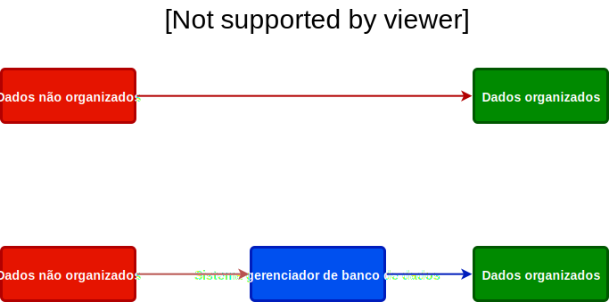

## Banco de dados

* Um [banco de dados](https://en.wikipedia.org/wiki/Database) é uma coleção 
organizada de dados a qual geralmente é armazenada e acessada 
eletronicamente por meio de um sistema computacional;

* O [sistema gerenciador de banco de dados (SGBD)](
https://en.wikipedia.org/wiki/Database#Database_management_system) é um
*software* que interage com usuários finais, aplicações e o próprio banco de
dados. O SGBD captura e analiza os dados.

