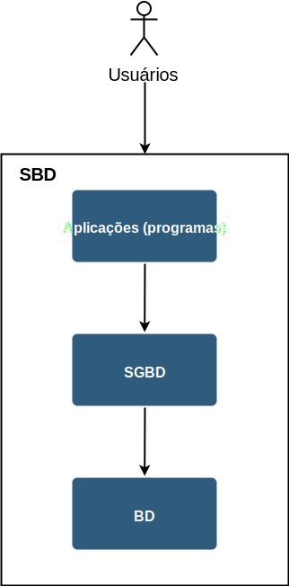
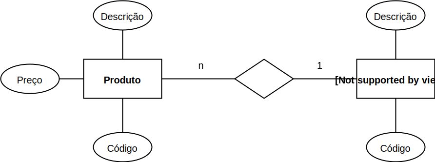

# Banco de dados - Conceitos

## Dado

Elemento primitivo de um banco de dados. São fatos que podem ser gravados e 
que possuem um significado implícito.

!!! example "Exemplo 2.1"
    Casa, carro, pessoa, professor, cidade, estado, país, aluno, dado, banco
    de dados ("recursão?"), etc.

## Banco de Dados

* Representa uma porção do mundo real, o qual chamamos de minimundo ou 
"universo de discurso". O banco de dados deve sempre refletir o estado atual
deste universo.

    !!! example "Exemplo 2.2"
        Se um banco de dados possui as entidades **professor e disciplina**; 
        quando o professor termina de lecionar a disciplina, o sistema que 
        consulta o banco de dados não pode informar que o professor ainda 
        leciona a disciplina após o término, pois o banco deve refletir o 
        estado
        atual deste universo.
    
        Isso pode ser feito de forma **automática ou manual**. Seria muito 
        mais 
        prático se fosse feito de forma automática. Se o período letivo 
        terminou, teoricamente a disciplina deve estar fechada.
    
        Porém às vezes é necessário que haja intervenção humana para que ações 
        sejam tomadas.
    

* Conjunto lógico e ordenado de dados que possuem algum significado, e não uma
coleção aleatória.

* É **projetado**, **construído** e **povoado** por dados, por meio de uma 
*interface* que geralmente é o SGBD.

## SGBD

Um **Sistema Gerenciador de Banco de Dados (SGBD)** é uma coleção de programas 
que permite aos usuários criar e manter (gerenciar ou administrar) um banco de 
dados.

* Definição (elementos e tipos dos dados)
* Construção (armazenamento de dados em mídia);
* Manipulação (consulta e atualização);
* Compartilhamento (de dados);
* Proteção do sistema (mal funcionamento);
* Segurança (ataques).

!!! example "Exemplo 2.3"
    * Definir um sistema de banco de dados para uma instituição de pesquisa;
    * É necessário existir dois bancos de dados separados, pois existem dois
      setores bem distintos dentro da instituição, e cada um desses setores 
      será responsável por administrar o seu respectivo banco. Por exemplo 
      **estatística** e **informática**;
    * De acordo com o projeto, o **banco de estatística deve ter 10 tabelas 
      (que se relacionam)**; já o **banco de informática precisa de 20 tabelas**;
    * Uma das tabelas de estatística é de disciplinas, que se relaciona com 
      uma tabela de professores, pois **cada professor pode lecionar N 
      disciplinas** durante um período de tempo; porém **uma disciplina só 
      pode ter um professor**;
    * Essas tabelas precisam ser criadas e **povoadas**, ou seja, dados 
      externos devem ser adicionados nas tabelas (construção e manipulação);
      Para povoar um banco é necessário que usuários adicionem esses novos 
      dados, ou outro sistema externo pode povoar esse banco caso seja 
      necessário;
    * Como os dados do banco de estatística é interessante para o 
      departamento de informática, esse banco é compartilhado apenas para o 
      departamento de informática por meio de acesso a um servidor adquirido
      que fica fisicamente no departamento de estatística e é compartilhado 
      por uma rede interna entre estatística e informática; outros 
      departamento não podem acessar esse banco de estatística; já o banco 
      de informática já é aberto para a instituição inteira;
    * O banco de informática faz espelhamento, os dados são duplicados para 
      caso haja perda total ou parcial de uma das duas cópias.

Antigamente cada aplicação (programa) fazia tudo, ou seja, interagia com o 
usuário, fazia os cálculos e armazenava em arquivos. Porém, foram sendo
identificadas funcionalidades comuns a muitos programas. Logo, para manter 
grandes repositórios compartilhados de dados, ou seja, para manter bancos de
dados, são usados sistemas de gerência de banco de dados (SGBD).

No mercado, há vários tipos de SGBD. Aqui, nos concentramos em um tipo de 
SGBD, **o relacional**, que domina o mercado da atualidade.

## SBD

Um **Sistema de Banco de Dados (SBD)** é sistema computacional criado para 
suportar/automatizar as operações de um determinado universo de discurso,
composto pelo banco de dados, por estruturas de armazenamento e mecanismos
para a manipulação de dados e informações (BD, SGBD e programas de aplicação).

## Modelo de banco de dados

**Modelo de (banco) dados:** descrição formal da estrutura de um banco de dados.

Usa-se linguagens para modelar um banco de dados, essas linguagens são 
**gráficas ou textuais**. Um mesmo modelo pode ser apresentado de várias 
formas.

### Níveis de modelos

Podemos colocar modelos em alguns níveis (alto, médio e baixo por exemplo).
 
Quanto mais alto o nível, mais longe (independente) de um BD final é o modelo. 
Modelos de alto nível são bem interessante para ter uma visão geral de um banco de
dados; já modelos de baixo nível estão mais próximos do BD (dependente) final, 
existem mais detalhes para evitar discordância, confusão ou até ambiguidade,
porém são  modelos que geram mais textos, detalhes e portanto ficam mais 
complexos.

### Modelo conceitual (nível alto)

A técnica mais difundida de modelagem conceitual é a abordagem 
**entidade-relacionamento (ER)**. Nesta técnica, um modelo conceitual é usualmente
representado através de um diagrama, chamado **diagrama entidade-relacionamento
(DER)**.

* Retângulos são **entidades**;
* Elipses são **atributos**;
* Losangos são **relacionamentos** que também podem ser nomeados;
* As cardinalidades são indicadas com número ou letra (1, n, m por exemplo);
* Atributos sublinhados indicam atributo único, não pode existir repetição. 
  Isso ajuda a identificar de forma **única** uma entidade.

    !!! example "Exemplo 2.4"
        Uma entidade quando levada para um DB (populado) gera **instâncias** 
        para o banco de dados. Por exemplo, uma entidade produto tem um 
        atributo nome = "iPhone" quando o DB é populado.
      
        Dessa forma, um código único (atributo único) deve ser atribuído para 
        esse iPhone (1 por exemplo); pois uma instância de produto com nome 
        "Galaxy" não pode ter o mesmo código.
        
        Isso gera uma identidade única para cada instância da tabela Produto
        do banco de dados.

A figura a seguir ilustra um DER de duas entidades: **Produto** e **Tipo de 
Produto**.

 

#### Exercício 1 para próxima aula

Gerar um diagrama de entidade e relacionamento com as seguintes entidades:
Aluno, Disciplina, Professor e Curso. Use poucos atributos. 

### Modelo lógico (nível intermediário) 

Um modelo lógico é uma descrição de um banco de dados no nível de abstração
visto pelo usuário do SGBD. Assim, o modelo lógico é **dependente do tipo
particular de SGBD** que está sendo usado.

Em um SGBD relacional, os dados estão organizados na
forma de **tabelas**. As tabelas a seguir são das entidades **Produto** e 
**Tipo de Produdo** respectivamente. 

|CodigoProduto|DescProduto  |PrecoProduto|CodigoTipoProduto|
|-------------|-------------|------------|-----------------|
|1            |iMac         |20.000      |1                |
|2            |Dell         |5.000       |1                |
|3            |Jato de tinta|1.000       |2                |
|4            |Laser        |2.000       |2                |

|CodigoTipoProduto|DescTipoProduto|
|-----------------|---------------|
|1                |Computador     |
|2                |Impressora     |

## Projeto de BD

Duas fases:

* Modelagem conceitual;
* Projeto lógico.