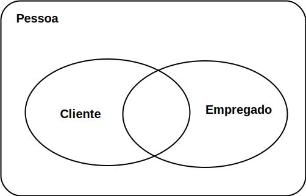

## Projeto de banco de dados

## Modelo de banco de dados

* **Modelo de (banco) dados:** descrição formal da estrutura de um banco de 
dados;

* Cada apresentação do modelo recebe a denominação **esquema de banco de 
dados**;

* Um mesmo modelo pode ser apresentados em diferentes esquemas. Um esquema é
  **descrição** do modelo; o modelo é o que engloba (abstrai) os esquemas. 
  Basicamente um mesmo modelo é apresentado por vários esquemas;

* Desafio: mapear um minimundo para um modelo de banco. Muitos conseguem usar
  um banco de dados, pouco conseguem modelar o banco consistente. Se você 
  tiver essa competência, será um diferencial, pois os conceitos de 
  modelagem de banco podem ser estendidos para outras disciplinas/domínios.

## Modelo conceitual (nível alto)

* A base do modelo entidade-relacionamento (MER), é representar o mundo real
  por meio de conjuntos de objetos chamados **entidades** e 
  **relacionamentos**;

* A junção ordenada/lógica destes tipos de objetos representa a estrutura/esquema
  do mundo real. Ou seja, deve suportar o armazenamento de dados que reflitam a
  situação do mundo real;

* A técnica mais difundida de modelagem conceitual é essa abordagem 
  **entidade-relacionamento (ER)**. Nesta técnica, um modelo conceitual é usualmente
  representado através de um diagrama, chamado **diagrama entidade-relacionamento
  (DER)**.

* Ajuda na comunicação com os usuários não-técnicos;

* As três noções básicas empregadas pelo MER: conjunto de entidades, conjunto 
  de relacionamentos, atributos;

* Retângulos são **entidades**;
* Elipses são **atributos**;
* Losangos são **relacionamentos** que também podem ser nomeados;
* As cardinalidades são indicadas com número ou letra (1, n, m por exemplo);
* Atributos sublinhados indicam atributo único, isto é, não pode existir 
  repetição dentro de uma tabela da coluna desse atributo. Isso ajuda a 
  identificar de forma **única** uma entidade.

    !!! example "Exemplo 3.3"
        Uma entidade quando levada para um DB (populado) gera **instâncias** 
        para o banco de dados. Por exemplo, uma entidade produto tem um 
        atributo nome = "iPhone" quando o DB é populado.
      
        Dessa forma, um código único (atributo único) deve ser atribuído para 
        esse iPhone (1 por exemplo); pois uma instância de produto com nome 
        "Galaxy" não pode ter o mesmo código.
        
        Isso gera uma identidade única para cada instância da tabela Produto
        do banco de dados.

A figura a seguir ilustra um DER de duas entidades: **Produto** e **Tipo de 
Produto**.

 

### Entidades

Definições:

* Uma entidade é uma “coisa” ou um “objeto” do mundo real que pode ser 
  identificada(o) de uma forma unívoca em relação a todos os outros objetos 
  ([Korth](
  https://www.google.com/search?q=Sistemas+de+Banco+de+Dados.+Silberschatz%2C+Korth+e+Sudarshan.+Makron+Books%2C+Segunda+Edi%C3%A7%C3%A3o.&oq=Sistemas+de+Banco+de+Dados.+Silberschatz%2C+Korth+e+Sudarshan.+Makron+Books%2C+Segunda+Edi%C3%A7%C3%A3o.&aqs=chrome..69i57.1458j0j7&sourceid=chrome&ie=UTF-8));
* Uma entidade pode ser concreta, como uma pessoa ou um livro, ou pode ser 
  abstrata, como um empréstimo ou uma viagem (Korth);
* Uma entidade é “algo” do mundo real, com uma existência independente 
  ([Navathe](
  https://www.google.com/search?q=Sistemas+de+Banco+de+Dados.+Elsmari+e+Navathe.+Pearson-Addison+Wesley%2C+Quarta+Edi%C3%A7%C3%A3o.&oq=Sistemas+de+Banco+de+Dados.+Elsmari+e+Navathe.+Pearson-Addison+Wesley%2C+Quarta+Edi%C3%A7%C3%A3o.&aqs=chrome..69i57.186j0j7&sourceid=chrome&ie=UTF-8)).
  
Entidades não são, necessariamente, conjuntos separados ou sempre disjuntos.
Por exemplo:

* O conjunto de todos os clientes de um banco constituem o conjunto entidade
  cliente; o conjunto de todos os empregados do banco constituem o conjunto
  entidade empregado; a entidade pessoa pode pertencer ou ao conjunto cliente,
  ou ao conjunto empregado ou a ambos ou a nenhum deles.

  

### Exercício 2.1 para casa

Gerar um diagrama de entidade e relacionamento com as seguintes entidades:
Aluno, Disciplina, Professor e Curso. Use poucos atributos nas entidades.

## Modelo lógico (nível intermediário) 

Um modelo lógico é uma descrição de um banco de dados no nível de abstração
visto pelo usuário do SGBD. Assim, o modelo lógico é **dependente do tipo
particular de SGBD** que está sendo usado.

Em um SGBD relacional, os dados estão organizados na forma de **tabelas**. 
As o esquema e tabelas a seguir são das entidades  **Tipo de Produdo** e
**Produto** respectivamente. 

**TipoDeProduto**(<u>CodigoTipoProduto</u>, DescTipoProduto)

**Produto**(<u>CodigoProduto</u>, DescProduto, PrecoProduto, CodigoTipoProduto)

* **CodigoTipoProduto** referencia a entidade TipoDeProduto.

**TipoDeProduto:**

|CodigoTipoProduto|DescTipoProduto|
|-----------------|---------------|
|1                |Computador     |
|2                |Impressora     |

**Produto:**

|CodigoProduto|DescProduto  |PrecoProduto|CodigoTipoProduto|
|-------------|-------------|------------|-----------------|
|1            |iMac         |20.000      |1                |
|2            |Dell         |5.000       |1                |
|3            |Jato de tinta|1.000       |2                |
|4            |Laser        |2.000       |2                |

### Exercício 2.2 para casa

Gerar o esquema lógico do exercício 2.1.

### Atributos 

* Propriedades particulares que descrevem uma entidade;

* Para cada atributo existe um conjunto de valores possíveis, chamado domínio;

* Domínio -> tipos de dados (inteiro, decimal, etc)

Tipos de atributos que ocorrem no modelo ER:

* Simples e Compostos;

* Univalorados e Multivalorados;

* Nulos;

* Armazenados versus Derivados;

* Atributos Complexos.

#### Atributos simples ou compostos

atributos compostos, diferentemente dos simples (atômicos), são divididos em
partes (em outros atributos).

* nome_cliente: prenome, nome_intermediário e sobrenome;
* Estes atributos podem ser hierarquizados.
