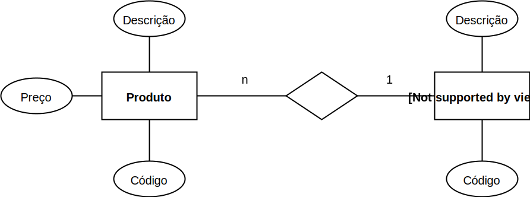

## Projeto de banco de dados

## Modelo de banco de dados

* **Modelo de (banco) dados:** descrição formal da estrutura de um banco de 
dados;

* Cada apresentação do modelo recebe a denominação **esquema de banco de 
dados**;

* Um mesmo modelo pode ser apresentados em diferentes esquemas. Um esquema é
  **descrição** do modelo; o modelo é o que engloba (abstrai) os esquemas. 
  Basicamente um mesmo modelo é apresentado por vários esquemas;

* Desafio: mapear um minimundo para um modelo de banco. Muitos consguem usar
  um banco de dados, pouco conseguem modelar o banco consistente. Se você 
  tiver essa competência, será um diferencial, pois os conceitos de 
  modelagem de banco podem ser extendidos para outras disciplinas/domínios.
 

## Modelo conceitual (nível alto)

A técnica mais difundida de modelagem conceitual é a abordagem 
**entidade-relacionamento (ER)**. Nesta técnica, um modelo conceitual é usualmente
representado através de um diagrama, chamado **diagrama entidade-relacionamento
(DER)**.

* Retângulos são **entidades**;
* Elipses são **atributos**;
* Losangos são **relacionamentos** que também podem ser nomeados;
* As cardinalidades são indicadas com número ou letra (1, n, m por exemplo);
* Atributos sublinhados indicam atributo único, isto é, não pode existir 
  repetição dentro de uma tabela da coluna desse atributo. Isso ajuda a 
  identificar de forma **única** uma entidade.

    !!! example "Exemplo 3.3"
        Uma entidade quando levada para um DB (populado) gera **instâncias** 
        para o banco de dados. Por exemplo, uma entidade produto tem um 
        atributo nome = "iPhone" quando o DB é populado.
      
        Dessa forma, um código único (atributo único) deve ser atribuído para 
        esse iPhone (1 por exemplo); pois uma instância de produto com nome 
        "Galaxy" não pode ter o mesmo código.
        
        Isso gera uma identidade única para cada instância da tabela Produto
        do banco de dados.

A figura a seguir ilustra um DER de duas entidades: **Produto** e **Tipo de 
Produto**.

 

### Exercício 2.1 para casa

Gerar um diagrama de entidade e relacionamento com as seguintes entidades:
Aluno, Disciplina, Professor e Curso. Use poucos atributos nas entidades. 

## Modelo lógico (nível intermediário) 

Um modelo lógico é uma descrição de um banco de dados no nível de abstração
visto pelo usuário do SGBD. Assim, o modelo lógico é **dependente do tipo
particular de SGBD** que está sendo usado.

Em um SGBD relacional, os dados estão organizados na forma de **tabelas**. 
As o esquema e tabelas a seguir são das entidades  **Tipo de Produdo** e
**Produto** respectivamente. 

**TipoDeProduto**(<u>CodigoTipoProduto</u>, DescTipoProduto)

**Produto**(<u>CodigoProduto</u>, DescProduto, PrecoProduto, CodigoTipoProduto)

* **CodigoTipoProduto** referencia a entidade TipoDeProduto.

**TipoDeProduto:**

|CodigoTipoProduto|DescTipoProduto|
|-----------------|---------------|
|1                |Computador     |
|2                |Impressora     |

**Produto:**

|CodigoProduto|DescProduto  |PrecoProduto|CodigoTipoProduto|
|-------------|-------------|------------|-----------------|
|1            |iMac         |20.000      |1                |
|2            |Dell         |5.000       |1                |
|3            |Jato de tinta|1.000       |2                |
|4            |Laser        |2.000       |2                |

### Exercício 2.2 para casa

Gerar o esquema lógico do exercídio 2.1.

## Projeto de BD

Duas fases:

* Modelagem conceitual;
* Projeto lógico.

### Modelagem idependente do SGDB

1. Levantamento e análise de requisitos
 
    Levantamento de requisitos é parte primeira no projeto do banco de dados
    que se for não for bem feito, pode levar facilmanente à ruína do sistema
    de banco de dados. Isso deve ser feito de forma iterativa, ou seja, o 
    projeto do banco é constante enquanto é pertinente. Deve ser feito 
    sempre que for necessário para o mesmo banco.

    1.1 Requisitos funcionais;

    !!! example "Exemplo 3.1"
        Uma relatório de notas do alunos deve ser mostrado ao usuário do
        sistema junto com a disciplina e professor responsável pela 
        disciplina.
        ---
        Questões:
        
        * Quais notas? Todas as notas? Notas de prova e trabalhos?
        * Mostrar apenas nome do aluno, ou mostrar também seu RA?
    

    1.1 Requisitos de dados;
    
    !!! example "Exemplo 3.2"
        Cada professor pode ter mais do que uma disciplina, e uma disciplina
        pode ter até 3 professor;

        Papel do projetista perguntar e questionar esses tipso de requisitos 
        de dados.

2. Análise funcional

    2.1 Especificação de transação de alto nível.
    
    !!! example "Exemplo 3.3"
        O usuário do banco de dados deve "selecionar" as entidades professor, 
        aluno, disciplina e notas; relacionar essas entidades fazendo 
        "junções" delas para mostrar de forma tabular as notas dos alunos.
        

3. Projeto conceitual

    3.1 Modelo conceitutal: um diagrama (esquema) de entidade-relacionamento.
 
### Modelagem dependente do SGDB
 
1. Projeto lógico: esquema lógico → projeto físico;

2. Projeto do programa de aplicação → implementação das transações;
