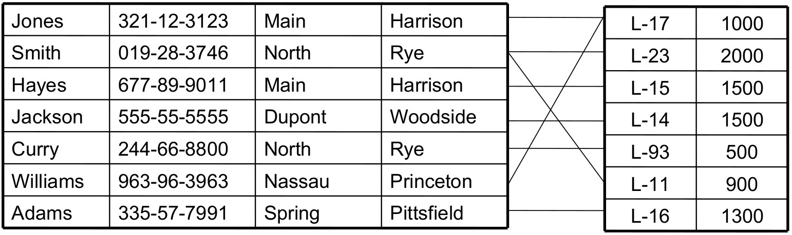
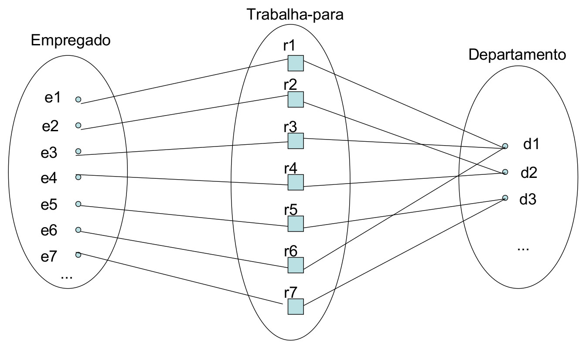
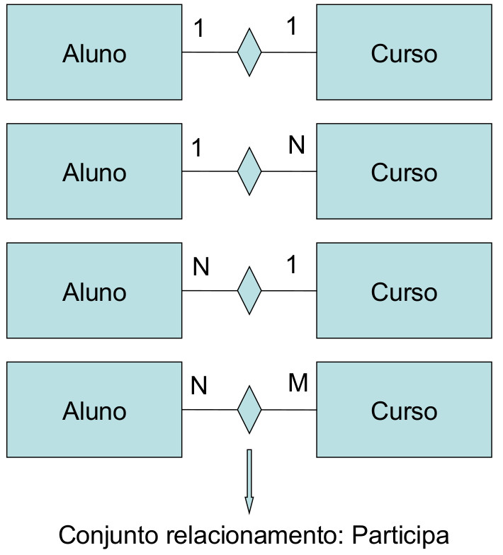

## Exercício de ER

* Uma empresa de bebidas quer automatizar algumas tarefas e processos;

* Bebidas tem tipos (whiskey, cerveja e suco primeiramente) e volume
  (mililitros). As bebidas também tem marca;

* O gerente do estabelecimento quer ver um relatório de vendas por período
  (dia, semana, mês e ano por exemplo) das bebidas de seu estabelecimento para
  saber se é preciso aumentar ou diminuir seu estoque nesses períodos
  apurados. O relatório deve conter bebidas agrupadas por tipo, quantidade
  vendida no período pertinente;

* O gerente da empresa quer cadastrar clientes que queiram ser cadastrados
  no sistema, para sugerir a eles produtos de acordo com o padrão de compra
  desses clientes. Um cliente tem um nome, data de nascimento, sexo,
  endereço. Logo, o gerente também quer relatórios de produtos que seus
  clientes consomem;

* Bebidas chegam ao estabelecimento por meio de fornecedores, os quais estão
  espalhados por vários lugares do Brasil. Logo o gerente quer relatórios de
  onde seus produtos estão sendo adquiridos. O gerente também quer saber quanto
  tempo leva em média de um determinado fornecedor para que um produto chegue
  a seu estabelecimento.


```Lógico tab=

```

```Lógico tab=
Bebida(id, tipo, volume, marca)

Venda(id, data)

Cliente(id, pnome, unome, nascimento, sexo)

Endereço(id, cep, complemento, número)

Fornecedor(id, nome)
```


## Relacionamentos    

* Um atributo de uma entidade refere-se a outra entidade;

* Refinamento: atributos são convertidos em relacionamentos entre as entidades;

* Um relacionamento é uma associação entre uma ou
várias entidades:

    * Um relacionamento que associa o cliente H com o empréstimo L-15
      especifica que o cliente H é o cliente que realizou o referido
      empréstimo.

* Tipo Relacionamento define um conjunto de associações ou um conjunto de
  relacionamentos entre entidades;

* A associação entre os conjuntos de entidades é referida como uma
  participação: o conjunto de entidades **E<sub>1</sub> , E<sub>2</sub>
  , ..., E<sub>m</sub>** **participa** do conjunto de relacionamentos **R**;

* Grau do relacionamento: o relacionamento binário (envolve dois
  conjuntos entidades) é um relacionamento de grau 2. E assim
  por diante;

* Exemplo:
    * Considere os conjuntos de entidades cliente e empréstimo;
    * Definimos o conjunto de relacionamentos devedor para denotar a
      associação entre clientes e empréstimos bancários contraídos pelos
      clientes.





* A função que uma entidade desempenha em um relacionamento é chamada papel;

* Algumas vezes o "conjunto entidade" pode participar de um
  "conjunto relacionamento" mais de uma vez em papéis diferentes e, nessas
  situações, o papel é importante para interpretação do modelo.


## Mapeamento de Restrições


Mapeamento das cardinalidades expressa o número de entidade às quais outra
entidade pode estar associada via um conjunto de relacionamentos.

* **Um para um**: uma entidade em A está associada no máximo a uma entidade em B,
  e uma entidade em B está associada a no máximo uma entidade em A;

* **Um para muitos**: Uma entidade em A está associada a várias entidades em B.
  Uma entidade em B deve estar associada no máximo a uma entidade em A;

* **Muitos para um**: Uma entidade em A está associada a no máximo uma entidade em
  B. Uma entidade em B, pode estar associada a um número qualquer de entidades
  em A;

* **Muitos para muitos**: Uma entidade em A está associada a qualquer número de
  entidades em B e uma entidade em B está associada a um número qualquer de
  entidades em A.



Exemplo:

* Considere o conjunto de entidades empréstimo e o conjunto de entidades
  pagamento (que mantém todas as informações sobre os pagamentos realizados
  para um determinado empréstimo);

* O conjunto de entidades empréstimo é considerado dominante e o conjunto de
  entidades pagamento é considerado subordinado;

* Se todas as entidades de um conjunto participam de pelo menos um
  relacionamento R, este é dito total, se apenas algumas das entidades do
  conjunto participam do relacionamento, então este é dito parcial;

* A participação total está estreitamente relacionada à existência de
  dependência. Para haver dependência de existência, a participação da
  entidade subordinada ao relacionamento correspondente deve ser total.


### Participação total ou parcial

* Total:

    * Representação: linha dupla;

    * Uma entidade pode existir apenas se participar de, pelo menos, uma
      instância do relacionamento que tem a restrição;

        * Empregado TRABALHA_PARA Departamento.

* Parcial:

    * Representação: linha única;

    * Algumas entidades estarão relacionadas a outra entidade por meio do
      relacionamento que impõe a restrição.

        * Empregado GERENCIA Departamento.
